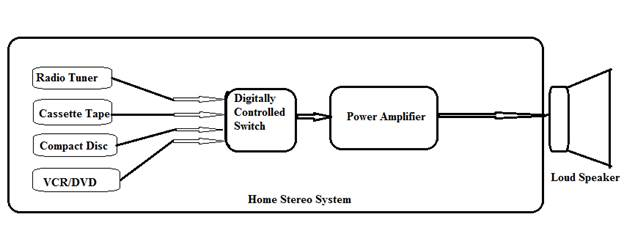
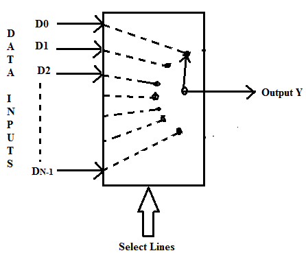
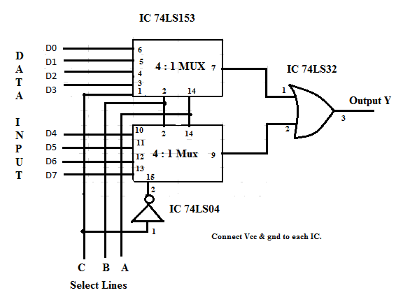
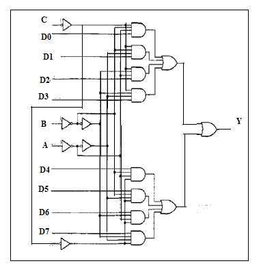

A modern home stereo system may have a switch that selects music from one or four sources: a radio tuner, a cassette tape, a compact disc (CD) or an auxiliary input. The auxiliary input could be an audio from VCR or DVD or a smart phone. The switch selects input from one of these four sources and connects it to the power amplifier and speakers as shown in Fig.1. In simple terms, this is what a multiplexer (MUX) does. A MUX is a combinational logic block that selects one-of-N inputs and directs the information to a single output. It acts like a multi-position switch. Mux is a well-known MSI (medium-scale integration) IC.&nbsp;

 
Fig.1. Block schematic: Home Stereo System

Multiplexer or Data Selector is a very widely used combinational circuit. It has multiple inputs and one output. It accepts several data inputs and allows only one of them at a time to get through to the output. The routing of the desired input to the output is controlled by the select lines. M select lines can select one of the 2M input channels. &nbsp;The generalized block schematic of a multiplexer is shown in Fig. 2. Mechanical rotary switch is a good analogy to explain the MUX concept.

 

Fig.2. Multiplexer Schematic: As a digitally controlled multiposition switch

The multiplexer selects 1 out of N input data sources and sends selected data to single output channel. This Many as to One function is called as Multiplexing. A data selector is a sort of one-package-solution to a complicated logic problem. It consists of large number of gates packaged inside a single integrated circuit (IC). It can be considered to belong to medium scale integration - MSI technology. 
MUX Applications: Multiplexers basically can be used as universal logic elements. It provides a low-cost reliable and compact solution to many logic problems with three to five input variables. The MUX applications include: 
1.&nbsp;&nbsp; &nbsp;Data Selection 
2.&nbsp;&nbsp; &nbsp;Data Routing 
3.&nbsp;&nbsp; &nbsp;Operation Sequencing 
4.&nbsp;&nbsp; &nbsp;Parallel &ndash;to-Serial Conversion 
5.&nbsp;&nbsp; &nbsp;Waveform Generation 
6.&nbsp;&nbsp; &nbsp;Logic Function Generation.

#### Design:
The functional name of IC 74LS153 is Dual 4 line to 1 Line Data Selector/Multiplexer. &nbsp; 
It implies that there are two 4: Multiplexers (Mux) inside the IC. It is a 16 pin Dual-In-Line Package (DIP) IC. Every 4:1 Mux comprises of four input lines, two select lines, one active low strobe line and a single output line. An 8:1 Mux should have eight input lines and three select lines and single output. To design an 8:1 Mux using IC 74LS153, we need to obtain three select lines using Strobe input and the select lines B and A. The strobe input &nbsp;can be treated as the third select line C, which is directly connected to upper 4:1 Mux and through a NOT gate to the lower 4:1 Mux. This will ensure that when C = 0, upper Mux is enabled and depending on select inputs B and A, one of the inputs from D0 to D3 will be passed/switched to its output. Similarly when C = 1, the lower Mux is enabled and depending on select inputs B and A, one of the inputs from D4 to D7 will be passed/switched to its output. &nbsp;The outputs of the two Muxes then can be given to an OR gate to produce the single final output Y as shown in Fig.3. The function table of the 8:1 MUX is given in Table 1. The Boolean expression defining the output is given by: 
Y = C&rsquo;. [B&rsquo;.A&rsquo;.D0 + B&rsquo;.A.D1 + B.A&rsquo;.D2 + B.A.D3] C. [B&rsquo;.A&rsquo;.D4 + B&rsquo;.A.D5 &nbsp;+ B.A&rsquo;.D6 &nbsp; &nbsp;+ B.A.D7 ] 
&nbsp;

 

Fig. 3. Eight to One Multiplexer using IC 74LS153

The logic diagram, &nbsp;for 8:1 MUX in &nbsp;IC 74LS153 is:

 

Fig. 4. Logic Diagram

 ####  Numerical:

		For 8:1 MUX, there are 8 inputs and 1 output.  
		For those 8 inputs the 3 select lines will be needed. (Since 23 = 8)  
		So the truth table of 8:1 MUX will be: 
		<table>
			<tr>
				<th colspan=3>Select Lines</th>
				<th colspan=8>Inputs</th>
				<th>Output</th>
				<th rowspan=2>MUX selected</th>
			</tr>
			<tr>
				<th>C</td>
				<th>B</td>
				<th>A</td>
				<th>D0</th>
				<th>D1</th>
				<th>D2</th>
				<th>D3</th>
				<th>D4</th>
				<th>D5</th>
				<th>D6</th>
				<th>D7</th>
				<th>Y</th>
			</tr>
			<tr>
				<td>0</td>
				<td>0</td>
				<td>0</td>
				<td>0</td>
				<td>X</td>
				<td>X</td>
				<td>X</td>
				<td>X</td>
				<td>X</td>
				<td>X</td>
				<td>X</td>
				<td>0</td>
				<td rowspan=8>Upper 4:1 MUX</td>
			</tr>
			<tr>
				<td>0</td>
				<td>0</td>
				<td>0</td>
				<td>1</td>
				<td>X</td>
				<td>X</td>
				<td>X</td>
				<td>X</td>
				<td>X</td>
				<td>X</td>
				<td>X</td>
				<td>1</td>
			</tr>
			<tr>
				<td>0</td>
				<td>0</td>
				<td>1</td>
				<td>X</td>
				<td>0</td>
				<td>X</td>
				<td>X</td>
				<td>X</td>
				<td>X</td>
				<td>X</td>
				<td>X</td>
				<td>0</td>
			</tr>
			<tr>
				<td>0</td>
				<td>0</td>
				<td>1</td>
				<td>X</td>
				<td>1</td>
				<td>X</td>
				<td>X</td>
				<td>X</td>
				<td>X</td>
				<td>X</td>
				<td>X</td>
				<td>1</td>
			</tr>
			<tr>
				<td>0</td>
				<td>1</td>
				<td>0</td>
				<td>X</td>
				<td>X</td>
				<td>0</td>
				<td>X</td>
				<td>X</td>
				<td>X</td>
				<td>X</td>
				<td>X</td>
				<td>0</td>
			</tr>
			<tr>
				<td>0</td>
				<td>1</td>
				<td>0</td>
				<td>X</td>
				<td>X</td>
				<td>1</td>
				<td>X</td>
				<td>X</td>
				<td>X</td>
				<td>X</td>
				<td>X</td>
				<td>1</td>
			</tr>
			<tr>
				<td>0</td>
				<td>1</td>
				<td>1</td>
				<td>X</td>
				<td>X</td>
				<td>X</td>
				<td>0</td>
				<td>X</td>
				<td>X</td>
				<td>X</td>
				<td>X</td>
				<td>0</td>
			</tr>
			<tr>
				<td>0</td>
				<td>1</td>
				<td>1</td>
				<td>X</td>
				<td>X</td>
				<td>X</td>
				<td>1</td>
				<td>X</td>
				<td>X</td>
				<td>X</td>
				<td>X</td>
				<td>1</td>
			</tr>
			<tr>
				<td>1</td>
				<td>0</td>
				<td>0</td>
				<td>X</td>
				<td>X</td>
				<td>X</td>
				<td>X</td>
				<td>0</td>
				<td>X</td>
				<td>X</td>
				<td>X</td>
				<td>0</td>
				<td rowspan=8>Lower 4:1 MUX</td>
			</tr>
			<tr>
				<td>1</td>
				<td>0</td>
				<td>0</td>
				<td>X</td>
				<td>X</td>
				<td>X</td>
				<td>X</td>
				<td>1</td>
				<td>X</td>
				<td>X</td>
				<td>X</td>
				<td>1</td>
			</tr>
			<tr>
				<td>1</td>
				<td>0</td>
				<td>1</td>
				<td>X</td>
				<td>X</td>
				<td>X</td>
				<td>X</td>
				<td>X</td>
				<td>0</td>
				<td>X</td>
				<td>X</td>
				<td>0</td>
			</tr>
			<tr>
				<td>1</td>
				<td>0</td>
				<td>1</td>
				<td>X</td>
				<td>X</td>
				<td>X</td>
				<td>X</td>
				<td>X</td>
				<td>1</td>
				<td>X</td>
				<td>X</td>
				<td>1</td>
			</tr>
			<tr>
				<td>1</td>
				<td>1</td>
				<td>0</td>
				<td>X</td>
				<td>X</td>
				<td>X</td>
				<td>X</td>
				<td>X</td>
				<td>X</td>
				<td>0</td>
				<td>X</td>
				<td>0</td>
			</tr>
			<tr>
				<td>1</td>
				<td>1</td>
				<td>0</td>
				<td>X</td>
				<td>X</td>
				<td>X</td>
				<td>X</td>
				<td>X</td>
				<td>X</td>
				<td>1</td>
				<td>X</td>
				<td>1</td>
			</tr>
			<tr>
				<td>1</td>
				<td>1</td>
				<td>1</td>
				<td>X</td>
				<td>X</td>
				<td>X</td>
				<td>X</td>
				<td>X</td>
				<td>X</td>
				<td>X</td>
				<td>0</td>
				<td>0</td>
			</tr>
			<tr>
				<td>1</td>
				<td>1</td>
				<td>1</td>
				<td>X</td>
				<td>X</td>
				<td>X</td>
				<td>X</td>
				<td>X</td>
				<td>X</td>
				<td>X</td>
				<td>1</td>
				<td>1</td>
			</tr>
		</table>
		 
		(Where : &lsquo;1&rsquo; indicate VCC/+5V,&nbsp;&nbsp;&nbsp;&nbsp;&nbsp; &lsquo;0&rsquo; indicate 0V, &nbsp;&nbsp;&nbsp;&nbsp;&nbsp;&nbsp;&lsquo;X&rsquo; indicate &ldquo;don&rsquo;t care&ldquo;)
	

